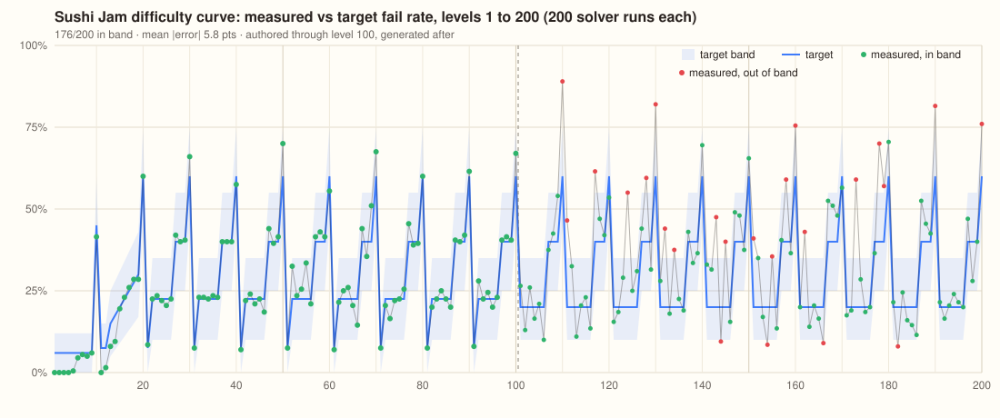

# Difficulty curve

`src/data/curve.json` is the single source of tuning numbers. One row per level:

| Field         | Meaning                                      |
| ------------- | -------------------------------------------- |
| `fail`        | target fail rate for the noisy solver (0..1) |
| `band`        | `[lo, hi]` the measured rate must land in    |
| `rows`,`cols` | grid size                                    |
| `colors`      | palette size (2..7)                          |
| `seats`       | counter seats                                |
| `beltCap`     | plates the belt holds before it jams         |
| `visibleNext` | plates shown in the kitchen window (0..3)    |
| `app`         | `[lo, hi]` appetite range                    |
| `fill`        | fraction of the grid the generator fills     |
| `speed`       | belt laps per second                         |

Plus `solver: { noise, runs, ciRuns }`: the solver's per-decision noise, the runs used at level build time for the tier badge, and the runs used by CI and the authoring tool.

The file holds levels 1 to 200. Past the last row the curve holds at its final values.

## The reward column

Each row also carries `reward`, the coins a win pays on that level. It is tuned by the economy model
(`npm run economy`, docs/economy.md) rather than by hand; rows without it fall back to the old 50 + 2n so an
older remote override still validates. Every other coin number lives in `src/data/products.json`.

## Who reads it

- `paramsFor(n)` and `schedTier(n)` in `src/engine/levels.ts` return the row (tier = `tierFromDiff(fail)`), so the generator, the map badges and the runtime belt speed all follow it.
- `makeGenerated(n)` picks, among its seeded candidates, the one whose measured fail rate is closest to `fail`; `evalLevel` uses `solver.noise` and `solver.runs`.
- `beatFor(n)` in `src/engine/author.ts` takes its numbers and band from the curve and only adds the beat kind, mechanic densities and the intro rule. The authoring tool writes `seats`, `beltCap` and `visibleNext` into a level file only when they differ from the curve, so authored levels follow the curve for everything their file leaves out (a file always pins its grid, colours, cells and kitchen).

Changing one number in `curve.json` therefore changes the game on the next launch with no code change. The CI test `tests/authored.test.ts` re-measures the 100 authored levels against the curve, so a change that pushes an authored level out of its band fails the build until the level is re-authored (`node tools/author-levels.mjs N N --force`).

## CI report

`npm run curve` (`tools/curve-report.mjs`) builds levels 1 to 200 exactly as the game does, measures each with `ciRuns` solver runs and writes `tools/out/curve-report.json`, `curve.md`, `curve.svg` and `curve.png`. CI uploads them as the **curve-report** artifact on every run. `--docs` also refreshes `docs/curve.svg`:

Green dots are in band, red are out. Generated levels past 100 are reported, not enforced.

## Remote override

At boot `applyCachedCurve()` applies the last validated download synchronously, then `fetchRemoteCurve()` fetches the URL in the background with a 4 s timeout, validates the JSON (`validateCurve`: version, contiguous levels, integer and range checks, target inside band), caches it in `localStorage` under `sushijam.curve` and applies it. The level cache is dropped on apply, so the level in play finishes as it started and the next one uses the new curve.

- URL: `VITE_CURVE_URL` at build time, default `https://a9inedev.github.io/sushi-jam/curve.json` (the build copies `curve.json` next to `index.html`, so a merged tuning change is live after the Pages deploy). The dev API can point a device at another URL (`__SJ.curve.setUrl`).
- Fallback: any failure (offline, HTTP error, timeout, bad JSON, wrong version, out-of-range values) keeps the current curve. The cache is dropped if it fails validation or was fetched from a different URL.
- Status: `__SJ.curve.status()` gives source (`bundled`, `cache`, `remote`), URL, last fetch time and last error. `__SJ.curve.reset()` clears the cache.

Tuning workflow: edit `curve.json`, run `npm test` and `npm run curve`, commit, push. CI publishes the file with the site; installed apps pick it up on their next launch.
