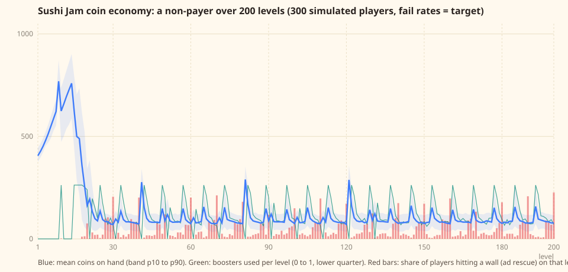

# Coin economy

Generated by `node tools/economy.mjs` from `src/data/curve.json` (the `reward` column) and `src/data/products.json`
(every other number). Re-run it after touching either file; `tests/economy.test.ts` pins the shipped numbers to the
targets below.

## Sources and sinks

| kind   | name               |              coins | per                         | note                                    |
| ------ | ------------------ | -----------------: | --------------------------- | --------------------------------------- |
| source | Level win          | 16 (level 100: 18) | level win                   | curve.json reward column                |
| source | Streak bonus       |                 25 | win, +5 per consecutive win | up to +25                               |
| source | Daily bonus        |                 60 | first launch of a day       | to 150 by day 7                         |
| source | Daily puzzle       |                 60 | first win of the day        | to 140 with a streak                    |
| source | Rush               |                  3 | plate served                | cap 300 per run                         |
| source | Zen                |   6 (level 100: 7) | board cleared               | 40% of the level reward                 |
| source | Boss board         |                100 | boss win                    | events only                             |
| source | Event rewards      |                250 | event finished              | 250 to 500 in events.json               |
| source | Season pass        |                 40 | tier (free track)           | 6,150 over 30 tiers                     |
| source | Decor set complete |                300 | restaurant                  | 300/400/500/600/700 per set             |
| source | Chef’s Rescue      |                200 | purchase                    | paid; +seat, diner served, belt cleared |
| source | Coin products      |                500 | purchase                    | Pouch 500, Chest 2,600, Starter 600     |
| sink   | VIP seat           |                180 | use (no inventory)          | extra seat for the level                |
| sink   | Takeout            |                240 | use (no inventory)          | removes a diner                         |
| sink   | Send Back          |                100 | use (no inventory)          | removes a plate                         |
| sink   | Decor              |                250 | item                        | 250 to 1,000, cosmetic                  |

Level reward: `round(16 + 0.02 n)`, from 16 at level 1 to 20 at level 200, stored per level in `curve.json` so the remote
override can tune it without a build. Streak bonus +5 per consecutive win, capped at +25. Daily bonus 60 rising to 150.
Boosters cost 100 / 180 / 240 coins (Send Back / VIP / Takeout), about 152 for the mix a player reaches for.

## The simulated non-payer

- Plays 8 levels a day, collects the daily bonus every day, does the daily puzzle half the days. No rush, zen,
  events, season or decor (all bonus income; the "engaged" row below adds the puzzle every day).
- Fails a level with the curve's target fail rate for that level (the noisy solver's rate, what the curve is
  verified against). Wants a booster on any level with a fail rate of 20% or more; a booster cuts the fail rate by
  60%. Reaches for Send Back half the time, VIP a third, Takeout the rest, and falls back to whatever is
  affordable. Inventory first, then coins.
- 2 fails in a row on a level with no booster left to buy is a **wall**: the player takes the free ad rescue.
  That is the moment a purchase (Chef's Rescue, coins) or an ad is the only way on.
- 300 players, seeded, averaged.

## Targets and results (fail rates = target)

| target                                  | value | band        |     |
| --------------------------------------- | ----: | ----------- | --- |
| one booster every three levels          |  2.85 | 2.5 to 3.5  | met |
| a wall roughly every 15 levels after 30 | 13.15 | 8.5 to 14.5 | met |
| few walls before 30                     |   1.1 | 0 to 1.5    | met |

- Income 10678 coins over 200 levels (53.4 per level); one booster (~152) every 2.85 levels of income.
- Boosters used: 92.8 (1.39 per three levels). Fails: 55.4. Walls: 14.25, of which 13.15 after level 30
  (one every 12.9 levels) and 1.1 before.
- Coins on hand end at 78 (10th percentile never below 31). Levels where a booster was wanted but not affordable: 121.2.
- Engaged player (daily puzzle every day): one booster every 2.34 levels, 11.98 walls after 30.

### Fails, boosters and walls per ten levels

| levels  | fails | boosters | walls |
| ------- | ----: | -------: | ----: |
| 1-10    |  0.81 |     1.19 |     0 |
| 11-20   |  1.68 |     6.25 |  0.16 |
| 21-30   |   3.2 |     4.73 |  0.94 |
| 31-40   |  3.26 |     4.12 |   0.9 |
| 41-50   |  2.55 |     5.46 |  0.58 |
| 51-60   |  2.83 |     4.49 |  0.73 |
| 61-70   |  3.15 |     4.27 |   0.9 |
| 71-80   |  3.01 |     4.38 |  0.82 |
| 81-90   |  2.53 |     5.57 |   0.6 |
| 91-100  |  2.76 |     4.56 |  0.66 |
| 101-110 |  3.04 |     4.38 |  0.83 |
| 111-120 |   3.1 |     4.48 |  0.86 |
| 121-130 |  2.54 |     5.54 |  0.64 |
| 131-140 |  2.81 |     4.69 |  0.74 |
| 141-150 |  3.05 |     4.51 |   0.8 |
| 151-160 |  3.18 |     4.46 |  0.87 |
| 161-170 |  2.91 |     5.69 |  0.75 |
| 171-180 |  2.84 |     4.83 |  0.74 |
| 181-190 |  3.06 |     4.54 |  0.88 |
| 191-200 |  3.08 |     4.61 |  0.86 |

## Why these numbers

- The old reward (50 + 2n, up to 450 a level) outran the sinks by level 40: a non-payer could buy a booster
  on every level and never met a wall. Boosters are the only mandatory sink, so the reward has to sit near a
  third of a booster per level for "one every three levels" to hold.
- A flat-ish reward keeps that ratio across the whole run; a small slope pays for the later levels wanting a
  booster almost every time. The daily bonus is a third of income early on, which is why the first thirty levels
  (fail rates under 20%) stay wall-free and the balance builds a cushion.
- Walls come from the curve, not from a coin shortage alone: after level 30 the fail targets sit at 30 to 60%,
  so a booster is wanted on nearly every level and the budget covers one in three. The rest is where the
  ad rescue, Chef's Rescue and the coin products earn their place, about every 12.9 levels.
- Booster prices stay at 100 / 180 / 240: the cheap Send Back is the workhorse, and the VIP seat's price makes it
  a decision rather than a reflex.
- Levels 141 to 200 have no authored files and the generator overshoots their bands (see docs/curve.md); the
  `--measured` run (docs/economy-measured.svg) shows what that does to walls until those levels are authored.

## Not modelled

Rush, zen, events, the season pass and decor add coins or spend them optionally; purchases are excluded by
definition. Booster effectiveness (60%) is an assumption to replace with telemetry once real
players exist; the model file has it as one number.
